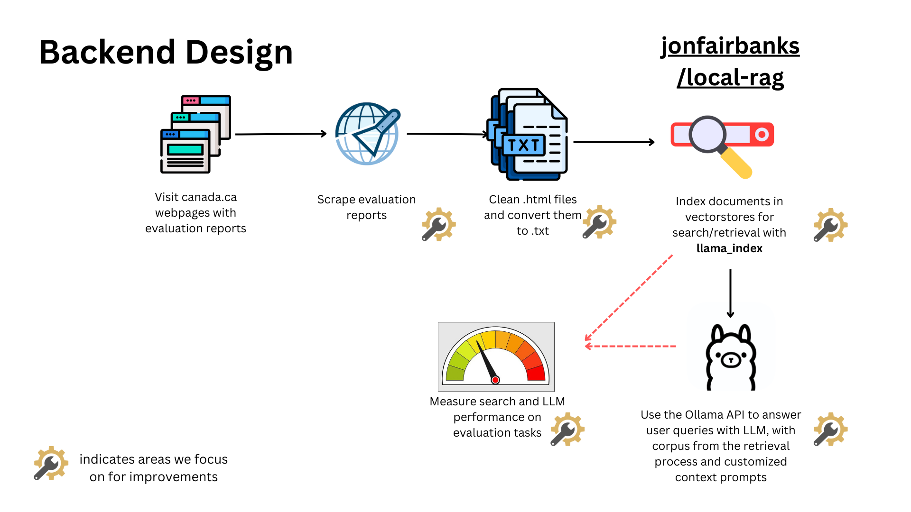

# 📚 LLM Program Evaluation Critique + Local-RAG

**Authors:** Henry Luan, Jesse Mendoza, Amin Kolahan

<p style="text-align: left;">
  
</p>

<p style="clear: both;"></p>

## Setup for the Streamlit App

1. Follow the [setup process of Local-RAG](https://github.com/jonfairbanks/local-rag/blob/develop/docs/setup.md).
2. Set up a conda environment named `conda-env-rag-3-10-14` using `conda-env-rag-3-10-14.yaml` and modify `run_app.py` to launch the application without using the command line.

## Feature Changes Implemented

- **Preload Evaluation Reports**: Updated `local_files.py` to read files directly from the `cleaned-evaluation-reports` folder.
- **Prompt Template**: Created a critique template for program evaluation reports in `utils.ollama`, based on the [Program Evaluation Checklist](https://wmich.edu/evaluation/checklists).
- **Run App Script**: Added `run_app.py` to launch the Streamlit app without requiring multiple command-line inputs.

<p style="text-align: left;">
  
</p>

<p style="clear: both;"></p>

## To-Do List

- **Shorten File Names**: Make file names shorter because Windows OS doesn't load long file paths.
- **Separate Scraping Service**: Make the scraping a separate microservice and store the data in the cloud; merge Jesse's and Amin's scraping pipelines.
- **Cloud Vectorstore**: Consider creating a cloud vectorstore to reduce load-time.
- **Improve Retrieval Process**: Integrate hybrid search and RRF retriever within the `llama_index` framework.
  - Consider Solr and ElasticSearch and apply advanced tuning techniques to optimize search (e.g. include dictionaries).
  - Include metadata; the LLM cannot precisely identify uploaded documents (maybe a limit of the context windows or retrieval process).
  - Fine-tune embeddings and the LLM with instructions ([source](https://crfm.stanford.edu/2023/03/13/alpaca.html)).
- **Enhance LLM Summarization**:
  - Use best practices in prompt engineering
  - The LLM struggles to answer "what are the files I uploaded?"
  - Use various prompt templates based on users' questions and their similarity to templates.
  - Explore best practices in design and leveraging agents.
- **Quality Measurement**: Measure the quality of the retrieval and LLM summarization processes.
- **Human Feedback**: Include a human feedback process to improve the LLM.
- **Deployment Optimization**: Create a deployment process (cloud or server) to optimize GPU and RAM, reducing latency.

## What I Tried/Learned

- **S3 Storage Bucket/Cloud storage**: Setting up S3 bucket where each Streamlit instance downloads files from S3 and makes a local copy is resource-intensive. A proper database is needed for lowering cost/reducing latency.

## Known Bug

- **Indexing Issue**: Local-RAG has a bug where new documents do not get indexed after the initial upload. Refer to [issue #61](https://github.com/jonfairbanks/local-rag/issues/61) for more details.

  ```plaintext
  2024-07-06 21:17:41,319 - rag_pipeline - INFO - Documents are already available; skipping document loading
  2024-07-06 21:17:41,320 - llama_index - INFO - Query Engine created successfully
  ```
